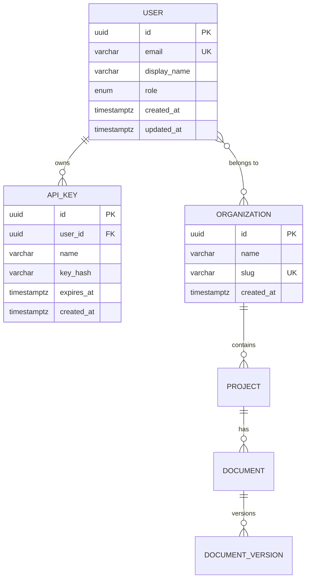

# Design Skill

> **Phase 2 of the SDLC.** Transforms discovery outputs (user stories,
> requirements, constraints) into implementation-ready design artifacts.

## Slash Commands

| Command | Description | Primary Output |
|---|---|---|
| `/design ui` | Design UI layouts, pages, and TailwindCSS v4 design system | Design system spec, page wireframes |
| `/design api` | Design REST API contracts with OpenAPI 3.1 | OpenAPI specification |
| `/design data` | Design data models, entities, and migration strategy | ER diagram, entity definitions, Flyway plan |
| `/design components` | Design SolidJS component tree and state architecture | Component hierarchy, state flow diagram |
| `/design security` | Design authentication, authorization, and validation layers | Security design document |
| `/design check` | Validate all design artifacts for consistency and completeness | Design review report |

---

## 1. UI/UX Design with TailwindCSS v4

### 1.1 CSS-First Configuration with @theme

TailwindCSS v4 replaces `tailwind.config.js` with a CSS-first approach.
All design tokens are defined in `src/app.css` using the `@theme` directive.

**Step 1 — Define the design token layer in `src/app.css`:**

```css
@import "tailwindcss";

@theme {
  /* ---- Color Palette ---- */
  --color-primary-50: oklch(0.97 0.01 260);
  --color-primary-100: oklch(0.93 0.03 260);
  --color-primary-200: oklch(0.87 0.06 260);
  --color-primary-300: oklch(0.78 0.10 260);
  --color-primary-400: oklch(0.70 0.14 260);
  --color-primary-500: oklch(0.62 0.18 260);
  --color-primary-600: oklch(0.54 0.20 260);
  --color-primary-700: oklch(0.47 0.18 260);
  --color-primary-800: oklch(0.40 0.14 260);
  --color-primary-900: oklch(0.34 0.10 260);
  --color-primary-950: oklch(0.26 0.06 260);

  --color-surface: oklch(1.00 0 0);
  --color-surface-secondary: oklch(0.97 0 0);
  --color-surface-elevated: oklch(1.00 0 0);

  --color-on-surface: oklch(0.15 0 0);
  --color-on-surface-secondary: oklch(0.45 0 0);
  --color-on-surface-variant: oklch(0.60 0 0);

  --color-success: oklch(0.72 0.19 155);
  --color-warning: oklch(0.80 0.18 85);
  --color-error: oklch(0.63 0.24 25);
  --color-info: oklch(0.68 0.16 240);

  /* ---- Typography ---- */
  --font-sans: "Inter", ui-sans-serif, system-ui, sans-serif;
  --font-mono: "JetBrains Mono", ui-monospace, monospace;

  --text-xs: 0.75rem;
  --text-sm: 0.875rem;
  --text-base: 1rem;
  --text-lg: 1.125rem;
  --text-xl: 1.25rem;
  --text-2xl: 1.5rem;
  --text-3xl: 1.875rem;
  --text-4xl: 2.25rem;

  /* ---- Spacing (4px base grid) ---- */
  --spacing-unit: 0.25rem;

  /* ---- Border Radius ---- */
  --radius-sm: 0.25rem;
  --radius-md: 0.375rem;
  --radius-lg: 0.5rem;
  --radius-xl: 0.75rem;
  --radius-2xl: 1rem;
  --radius-full: 9999px;

  /* ---- Shadows ---- */
  --shadow-sm: 0 1px 2px 0 oklch(0 0 0 / 0.05);
  --shadow-md: 0 4px 6px -1px oklch(0 0 0 / 0.1);
  --shadow-lg: 0 10px 15px -3px oklch(0 0 0 / 0.1);

  /* ---- Animations ---- */
  --animate-fade-in: fade-in 0.2s ease-out;
  --animate-slide-up: slide-up 0.3s ease-out;
  --animate-spin: spin 1s linear infinite;

  /* ---- Breakpoints (overriding defaults) ---- */
  --breakpoint-xs: 475px;
  --breakpoint-sm: 640px;
  --breakpoint-md: 768px;
  --breakpoint-lg: 1024px;
  --breakpoint-xl: 1280px;
  --breakpoint-2xl: 1536px;
}

@keyframes fade-in {
  from { opacity: 0; }
  to { opacity: 1; }
}

@keyframes slide-up {
  from { opacity: 0; transform: translateY(8px); }
  to { opacity: 1; transform: translateY(0); }
}

@keyframes spin {
  to { transform: rotate(360deg); }
}
```

**Step 2 — Use custom tokens via utility classes:**

```html
<button class="bg-primary-600 hover:bg-primary-700 text-surface
               rounded-lg px-4 py-2 text-sm font-medium
               shadow-sm transition-colors duration-150">
  Primary Action
</button>
```

### 1.2 Design Token Naming Conventions

| Token Category | Prefix | Example | Usage |
|---|---|---|---|
| Brand colors | `--color-primary-*` | `bg-primary-600` | CTAs, links, active states |
| Surface colors | `--color-surface*` | `bg-surface-elevated` | Cards, modals, panels |
| On-surface text | `--color-on-surface*` | `text-on-surface-secondary` | Body text, labels, hints |
| Semantic colors | `--color-success`, `--color-error`, etc. | `text-error` | Status indicators |
| Typography | `--font-*`, `--text-*` | `font-mono`, `text-sm` | Text rendering |
| Radius | `--radius-*` | `rounded-lg` | Container shapes |
| Shadows | `--shadow-*` | `shadow-md` | Elevation hierarchy |

### 1.3 Layout System

Design all pages using a consistent layout hierarchy:

```
┌─────────────────────────────────────────────────┐
│ RootLayout                                       │
│ ┌─────────────────────────────────────────────┐ │
│ │ Header (fixed, h-16, z-50)                  │ │
│ │  ┌─ Logo  ── Navigation ──────── UserMenu ─┐│ │
│ │  └─────────────────────────────────────────┘│ │
│ ├─────────────────────────────────────────────┤ │
│ │ ┌──────────┐ ┌────────────────────────────┐ │ │
│ │ │ Sidebar  │ │ Main Content               │ │ │
│ │ │ (w-64)   │ │  ┌──────────────────────┐  │ │ │
│ │ │          │ │  │ PageHeader            │  │ │ │
│ │ │ NavTree  │ │  │  Title + Breadcrumbs  │  │ │ │
│ │ │          │ │  ├──────────────────────┤  │ │ │
│ │ │          │ │  │ Content Area          │  │ │ │
│ │ │          │ │  │  (scrollable)         │  │ │ │
│ │ │          │ │  └──────────────────────┘  │ │ │
│ │ └──────────┘ └────────────────────────────┘ │ │
│ └─────────────────────────────────────────────┘ │
│ ┌─────────────────────────────────────────────┐ │
│ │ Footer (optional)                           │ │
│ └─────────────────────────────────────────────┘ │
└─────────────────────────────────────────────────┘
```

**Responsive breakpoints:**

| Breakpoint | Width | Layout Behavior |
|---|---|---|
| `xs` | 475px | Single column, stacked nav |
| `sm` | 640px | Single column, hamburger menu |
| `md` | 768px | Two-column, collapsible sidebar |
| `lg` | 1024px | Full layout with persistent sidebar |
| `xl` | 1280px | Expanded content area |
| `2xl` | 1536px | Max-width container, centered |

### 1.4 Component Styling Patterns

**Pattern A — Inline Tailwind (preferred for leaf components):**

```tsx
// src/components/ui/Button.tsx
import { type JSX, splitProps } from "solid-js";
import { Dynamic } from "solid-js/web";

type ButtonVariant = "primary" | "secondary" | "ghost" | "destructive";
type ButtonSize = "sm" | "md" | "lg";

const variantClasses: Record<ButtonVariant, string> = {
  primary: "bg-primary-600 text-surface hover:bg-primary-700 shadow-sm",
  secondary: "bg-surface-secondary text-on-surface hover:bg-surface-elevated border border-on-surface/10",
  ghost: "text-on-surface-secondary hover:bg-surface-secondary",
  destructive: "bg-error text-surface hover:bg-error/90",
};

const sizeClasses: Record<ButtonSize, string> = {
  sm: "px-3 py-1.5 text-xs rounded-md",
  md: "px-4 py-2 text-sm rounded-lg",
  lg: "px-6 py-3 text-base rounded-lg",
};

interface ButtonProps extends JSX.ButtonHTMLAttributes<HTMLButtonElement> {
  variant?: ButtonVariant;
  size?: ButtonSize;
  as?: "button" | "a";
  loading?: boolean;
}

export function Button(props: ButtonProps) {
  const [local, rest] = splitProps(props, [
    "variant", "size", "as", "loading", "class", "children",
  ]);

  return (
    <Dynamic
      component={local.as ?? "button"}
      class={[
        "inline-flex items-center justify-center font-medium",
        "transition-colors duration-150",
        "focus-visible:outline-2 focus-visible:outline-offset-2 focus-visible:outline-primary-500",
        "disabled:opacity-50 disabled:pointer-events-none",
        variantClasses[local.variant ?? "primary"],
        sizeClasses[local.size ?? "md"],
        local.class,
      ].filter(Boolean).join(" ")}
      disabled={local.loading || rest.disabled}
      {...rest}
    >
      {local.loading && (
        <iconify-icon icon="lucide:loader-2" class="animate-spin mr-2" width="16" height="16" />
      )}
      {local.children}
    </Dynamic>
  );
}
```

**Pattern B — @apply for shared composite classes (use sparingly):**

```css
/* src/app.css — only for patterns reused > 5 times */
@layer components {
  .card {
    @apply bg-surface rounded-xl border border-on-surface/5 shadow-sm;
  }
  .card-header {
    @apply px-6 py-4 border-b border-on-surface/5;
  }
  .card-body {
    @apply px-6 py-4;
  }
  .page-title {
    @apply text-2xl font-semibold text-on-surface tracking-tight;
  }
}
```

### 1.5 Dark Mode

TailwindCSS v4 dark mode uses `@media (prefers-color-scheme: dark)` by default.
For manual toggle, use the `dark` variant with a `.dark` class on `<html>`:

```css
@theme {
  --color-surface: oklch(1.00 0 0);
  --color-on-surface: oklch(0.15 0 0);
}

/* In @theme, provide dark variants as separate tokens */
@custom-variant dark (&:where(.dark, .dark *));
```

```css
/* Then override in dark context */
@variant dark {
  :root {
    --color-surface: oklch(0.15 0 0);
    --color-on-surface: oklch(0.95 0 0);
    --color-surface-secondary: oklch(0.20 0 0);
    --color-surface-elevated: oklch(0.25 0 0);
  }
}
```

### 1.6 Accessibility-First Design Rules

1. **Color contrast**: All text/background combinations must meet WCAG AA (4.5:1 for normal text, 3:1 for large text). Verify with `oklch` contrast tools.
2. **Focus indicators**: Every interactive element gets visible focus rings via `focus-visible:outline-2 focus-visible:outline-offset-2 focus-visible:outline-primary-500`.
3. **Motion**: Respect `prefers-reduced-motion`. Wrap animations:
   ```css
   @media (prefers-reduced-motion: no-preference) {
     .animate-slide-up { animation: var(--animate-slide-up); }
   }
   ```
4. **Semantic HTML**: Use `<nav>`, `<main>`, `<article>`, `<section>`, `<aside>`, `<header>`, `<footer>` — never `<div>` when a semantic element exists.
5. **ARIA**: Add `aria-label`, `aria-describedby`, `role` attributes only when semantic HTML is insufficient.
6. **Keyboard navigation**: All interactive elements must be reachable via Tab; modals must trap focus.

---

## 2. SolidJS Component Architecture

### 2.1 Directory Structure

```
src/
├── app.css                          # @theme tokens, global styles
├── app.tsx                          # Root component (<Html>, <Head>, <Body>)
├── entry-client.tsx                 # Client-side hydration entry
├── entry-server.tsx                 # Server-side rendering entry
│
├── routes/                          # File-based routing (SolidStart)
│   ├── index.tsx                    # Home page
│   ├── (auth)/                      # Route group — shared layout
│   │   ├── login.tsx
│   │   ├── register.tsx
│   │   └── layout.tsx               # AuthLayout (centered card)
│   ├── (dashboard)/                 # Route group — authenticated pages
│   │   ├── layout.tsx               # DashboardLayout (sidebar + header)
│   │   ├── dashboard/
│   │   │   └── index.tsx
│   │   ├── settings/
│   │   │   ├── index.tsx            # Settings list
│   │   │   └── [section].tsx        # Dynamic settings section
│   │   └── users/
│   │       ├── index.tsx            # User list
│   │       └── [id].tsx             # User detail
│   └── api/                         # API routes (if SolidStart server)
│       └── health.ts
│
├── components/                      # Reusable components
│   ├── layout/                      # Layout primitives
│   │   ├── AppShell.tsx             # Top-level shell
│   │   ├── Header.tsx               # Global header
│   │   ├── Sidebar.tsx              # Navigation sidebar
│   │   ├── Footer.tsx               # Global footer
│   │   └── Breadcrumbs.tsx          # Navigation breadcrumbs
│   │
│   ├── ui/                          # Design system primitives (no domain logic)
│   │   ├── Button.tsx
│   │   ├── Input.tsx
│   │   ├── Select.tsx
│   │   ├── Textarea.tsx
│   │   ├── Checkbox.tsx
│   │   ├── Switch.tsx
│   │   ├── Badge.tsx
│   │   ├── Card.tsx
│   │   ├── Dialog.tsx
│   │   ├── Dropdown.tsx
│   │   ├── Tooltip.tsx
│   │   ├── Table.tsx
│   │   ├── Pagination.tsx
│   │   ├── Toast.tsx
│   │   ├── Spinner.tsx
│   │   ├── Skeleton.tsx
│   │   ├── Tabs.tsx
│   │   ├── Avatar.tsx
│   │   └── Divider.tsx
│   │
│   └── shared/                      # Shared composite components
│       ├── DataTable.tsx             # Table + pagination + filters
│       ├── FormField.tsx             # Label + input + error message
│       ├── SearchInput.tsx           # Input with debounce + icon
│       ├── ConfirmDialog.tsx         # Reusable confirmation modal
│       ├── EmptyState.tsx            # Empty state illustration
│       ├── ErrorBoundary.tsx         # Error boundary wrapper
│       └── PageHeader.tsx            # Title + description + actions
│
├── lib/                             # Domain-agnostic utilities
│   ├── api/
│   │   ├── client.ts                # HTTP client wrapper (fetch with interceptors)
│   │   ├── errors.ts                # RFC 7807 error types
│   │   └── query.ts                 # Query/mutation helpers for createResource
│   ├── validation/
│   │   ├── schemas.ts               # Shared Zod/Valibot schemas
│   │   └── utils.ts                 # Validation utilities
│   └── utils/
│       ├── format.ts                # Date, number formatting
│       ├── cn.ts                    # Class name merge utility (clsx + twMerge)
│       └── debounce.ts              # Debounce/throttle helpers
│
├── stores/                          # Global state stores
│   ├── auth.ts                      # Auth state (user, tokens, session)
│   ├── theme.ts                     # Theme state (light/dark/system)
│   ├── notifications.ts             # Toast/notification queue
│   └── ui.ts                        # UI state (sidebar open, modals)
│
├── hooks/                           # Custom SolidJS primitives
│   ├── useMediaQuery.ts             # Responsive breakpoint detection
│   ├── useClickOutside.ts           # Click outside detection
│   ├── useLocalStorage.ts           # Persistent local state
│   ├── useKeyboard.ts               # Keyboard shortcut handler
│   └── useDebounce.ts              # Debounced signal value
│
└── types/                           # Shared TypeScript types
    ├── api.ts                       # API request/response types
    ├── models.ts                    # Domain model types
    └── ui.ts                        # UI component prop types
```

### 2.2 Component Classification

| Category | Location | Characteristics | Examples |
|---|---|---|---|
| **Layout** | `components/layout/` | Structural containers, no domain logic | `AppShell`, `Header`, `Sidebar` |
| **Page** | `routes/*/` | Route-bound, composes features + layouts | `routes/(dashboard)/users/index.tsx` |
| **Feature** | `components/shared/` | Domain-aware composite components | `DataTable`, `FormField` |
| **UI Primitive** | `components/ui/` | Domain-agnostic, style-only | `Button`, `Input`, `Dialog` |
| **Hook** | `hooks/` | Reusable reactive logic | `useMediaQuery`, `useDebounce` |

### 2.3 Component Design Principles

1. **Props over Context for simple data flow.** Use Context only when data must traverse > 2 levels.
2. **Single Responsibility.** Each component does one thing. If it exceeds 150 lines, split it.
3. **Controlled by default.** Components own their state only when the parent doesn't need to control it.
4. **`splitProps` for forwarding.** Always use `splitProps` to separate consumed props from forwarded rest props.
5. **Type-safe generics for reusable components.** Use TypeScript generics for `DataTable<T>`, `Select<T>`, etc.

### 2.4 Component Template

```tsx
import { type Component, type JSX, splitProps, mergeProps } from "solid-js";

interface WidgetProps {
  /** Short description of what the widget displays */
  label: string;
  /** Optional visual variant */
  variant?: "default" | "compact";
  /** Click handler */
  onClick?: () => void;
  /** Additional CSS classes */
  class?: string;
  /** Child content */
  children?: JSX.Element;
}

const defaultProps: Required<Pick<WidgetProps, "variant">> = {
  variant: "default",
};

export const Widget: Component<WidgetProps> = (rawProps) => {
  const props = mergeProps(defaultProps, rawProps);
  const [local, rest] = splitProps(props, [
    "label", "variant", "onClick", "class", "children",
  ]);

  return (
    <div
      class={[
        "rounded-lg border p-4",
        local.variant === "compact" ? "p-2" : "p-4",
        local.class,
      ].filter(Boolean).join(" ")}
      onClick={local.onClick}
    >
      <span class="text-sm font-medium text-on-surface">{local.label}</span>
      {local.children}
    </div>
  );
};
```

---

## 3. State Management

### 3.1 State Architecture Decision Tree

```
Where is the state needed?
│
├─ Single component only
│  └─ createSignal (primitive) or createStore (object)
│
├─ Parent + direct children
│  └─ Props (props drilling is OK for 1-2 levels)
│
├─ Many components across the tree
│  └─ Context + createStore
│
├─ Async data from API
│  └─ createResource (with fetcher function)
│
├─ Derived from other state
│  └─ createMemo (pure computation, cached)
│
└─ Cross-cutting (auth, theme, notifications)
   └─ Dedicated store module + Context
```

### 3.2 Signal Patterns

```tsx
import { createSignal, createMemo, createSelector } from "solid-js";

// Primitive state
const [count, setCount] = createSignal(0);

// Object state (use createStore for nested reactivity)
const [user, setUser] = createStore({
  name: "",
  email: "",
  preferences: { theme: "system" as "light" | "dark" | "system" },
});

// Derived state
const displayName = createMemo(() =>
  user.name.trim() || user.email.split("@")[0]
);

// Selection state (optimized for list selection)
const [selectedId, setSelectedId] = createSignal<string | null>(null);
const isSelected = createSelector(selectedId);
// Usage: <div classList={{ selected: isSelected(item.id) }} />
```

### 3.3 Store Patterns

```tsx
import { createStore, produce, unwrap } from "solid-js/store";

interface Notification {
  id: string;
  type: "info" | "success" | "warning" | "error";
  message: string;
  timestamp: number;
}

interface NotificationState {
  items: Notification[];
  maxVisible: number;
}

const [state, setState] = createStore<NotificationState>({
  items: [],
  maxVisible: 5,
});

// Immutable update pattern
function addNotification(notification: Omit<Notification, "id" | "timestamp">) {
  setState(produce((s) => {
    s.items.unshift({
      ...notification,
      id: crypto.randomUUID(),
      timestamp: Date.now(),
    });
    if (s.items.length > s.maxVisible) {
      s.items = s.items.slice(0, s.maxVisible);
    }
  }));
}

function removeNotification(id: string) {
  setState("items", (items) => items.filter((n) => n.id !== id));
}
```

### 3.4 Resource Patterns (Async Data)

```tsx
import { createResource, createSignal, Show, For } from "solid-js";
import type { Accessor } from "solid-js";

// --- Fetcher function ---
async function fetchUsers(page: Accessor<number>): Promise<PaginatedResponse<User>> {
  const res = await fetch(`/api/users?page=${page()}&size=20`);
  if (!res.ok) throw new ApiError(res);
  return res.json();
}

// --- Resource in component ---
function UserList() {
  const [page, setPage] = createSignal(1);
  const [users] = createResource(page, fetchUsers);

  return (
    <Show
      when={!users.loading && !users.error}
      fallback={
        <Show when={users.error} fallback={<SkeletonTable rows={5} />}>
          <ErrorState error={users.error!} onRetry={users.refetch} />
        </Show>
      }
    >
      <DataTable
        data={users()!.items}
        columns={userColumns}
        pagination={{
          page: page(),
          totalPages: users()!.totalPages,
          onPageChange: setPage,
        }}
      />
    </Show>
  );
}
```

### 3.5 Context Patterns

```tsx
import { createContext, useContext, type Component } from "solid-js";
import { createStore } from "solid-js/store";

// --- Define context type ---
interface AuthContextValue {
  user: User | null;
  isAuthenticated: boolean;
  login: (credentials: LoginRequest) => Promise<void>;
  logout: () => Promise<void>;
}

// --- Create context (undefined sentinel pattern) ---
const AuthContext = createContext<AuthContextValue>();

// --- Custom hook with guard ---
function useAuth(): AuthContextValue {
  const ctx = useContext(AuthContext);
  if (!ctx) throw new Error("useAuth must be used within <AuthProvider>");
  return ctx;
}

// --- Provider component ---
const AuthProvider: Component<{ children: JSX.Element }> = (props) => {
  const [state, setState] = createStore({ user: null as User | null });

  // Check session on mount
  const [session] = createResource(fetchSession);

  createEffect(() => {
    if (session()) setState("user", session()!.user);
  });

  const login = async (credentials: LoginRequest) => {
    const response = await authApi.login(credentials);
    setState("user", response.user);
  };

  const logout = async () => {
    await authApi.logout();
    setState("user", null);
  };

  const value: AuthContextValue = {
    get user() { return state.user; },
    get isAuthenticated() { return state.user !== null; },
    login,
    logout,
  };

  return (
    <AuthContext.Provider value={value}>
      {props.children}
    </AuthContext.Provider>
  );
};

export { AuthProvider, useAuth };
```

---

## 4. Data Model Design

### 4.1 Entity Design Process

1. **Identify entities** from user stories and requirements.
2. **Define attributes** with types, constraints, and nullability.
3. **Establish relationships** (one-to-one, one-to-many, many-to-many).
4. **Determine keys** (natural vs surrogate, composite keys).
5. **Design indexes** based on query patterns from API requirements.
6. **Plan migrations** as sequential, reversible Flyway scripts.

### 4.2 Entity Definition Template

For each entity, document:

```yaml
Entity: User
Table: users
Description: Represents an authenticated user of the application.

Attributes:
  - name: id
    type: UUID
    column: id
    constraints: [PRIMARY KEY, NOT NULL, DEFAULT gen_random_uuid()]
    notes: Surrogate key

  - name: email
    type: VARCHAR(255)
    column: email
    constraints: [NOT NULL, UNIQUE]
    notes: Used as login identifier

  - name: displayName
    type: VARCHAR(100)
    column: display_name
    constraints: [NOT NULL]
    notes: User-visible name

  - name: role
    type: ENUM
    column: role
    constraints: [NOT NULL, DEFAULT 'user']
    values: [admin, user, viewer]
    notes: RBAC role

  - name: createdAt
    type: TIMESTAMP WITH TIME ZONE
    column: created_at
    constraints: [NOT NULL, DEFAULT now()]
    notes: Audit timestamp

  - name: updatedAt
    type: TIMESTAMP WITH TIME ZONE
    column: updated_at
    constraints: [NOT NULL, DEFAULT now()]
    notes: Auto-updated on modification

Relationships:
  - target: Organization
    type: many-to-many
    through: organization_members
    joinColumn: user_id
    inverseJoinColumn: organization_id

  - target: ApiKey
    type: one-to-many
    mappedBy: user_id
    cascade: [DELETE]

Indexes:
  - name: idx_users_email
    columns: [email]
    unique: true

  - name: idx_users_created_at
    columns: [created_at]
    type: btree
```

### 4.3 ER Diagram Format

Use Mermaid syntax for entity-relationship diagrams:



### 4.4 Flyway Migration Strategy

**Naming convention:**

```
db/migration/
├── V001__create_users_table.sql
├── V002__create_organizations_table.sql
├── V003__create_organization_members_table.sql
├── V004__create_projects_table.sql
├── V005__create_documents_table.sql
├── V006__create_document_versions_table.sql
├── V007__create_api_keys_table.sql
├── V008__add_user_preferences_column.sql
└── R001__seed_roles.sql            # Repeatable migrations (R prefix)
```

**Migration template:**

```sql
-- V001__create_users_table.sql
-- Description: Create the users table with basic authentication fields.

CREATE TABLE users (
    id              UUID            PRIMARY KEY DEFAULT gen_random_uuid(),
    email           VARCHAR(255)    NOT NULL,
    display_name    VARCHAR(100)    NOT NULL,
    role            VARCHAR(20)     NOT NULL DEFAULT 'user',
    password_hash   VARCHAR(255)    NOT NULL,
    created_at      TIMESTAMPTZ     NOT NULL DEFAULT now(),
    updated_at      TIMESTAMPTZ     NOT NULL DEFAULT now(),

    CONSTRAINT uq_users_email UNIQUE (email),
    CONSTRAINT ck_users_role CHECK (role IN ('admin', 'user', 'viewer'))
);

CREATE INDEX idx_users_email ON users (email);
CREATE INDEX idx_users_created_at ON users (created_at);

-- Trigger for auto-updating updated_at
CREATE OR REPLACE FUNCTION update_updated_at_column()
RETURNS TRIGGER AS $$
BEGIN
    NEW.updated_at = now();
    RETURN NEW;
END;
$$ LANGUAGE plpgsql;

CREATE TRIGGER trg_users_updated_at
    BEFORE UPDATE ON users
    FOR EACH ROW
    EXECUTE FUNCTION update_updated_at_column();
```

### 4.5 Java 21 Record Mapping

Map database entities to Java records for immutable DTOs and sealed interfaces
for type-safe domain modeling:

```java
// Backend entity record
public record User(
    UUID id,
    String email,
    String displayName,
    UserRole role,
    Instant createdAt,
    Instant updatedAt
) {}

// Sealed interface for role hierarchy
public sealed interface UserRole permits AdminRole, UserRole, ViewerRole {
    String value();
    Set<Permission> permissions();
}

public record AdminRole() implements UserRole {
    @Override public String value() { return "admin"; }
    @Override public Set<Permission> permissions() { return Set.of(Permission.ALL); }
}

// Sealed interface for query results
public sealed interface QueryResult<T> permits SuccessResult, EmptyResult, ErrorResult {
    record SuccessResult<T>(List<T> items, long total, int page) implements QueryResult<T> {}
    record EmptyResult<T>() implements QueryResult<T> {}
    record ErrorResult<T>(String code, String message) implements QueryResult<T> {}
}
```

---

## 5. API Contract Design

### 5.1 REST Conventions

| Aspect | Convention | Example |
|---|---|---|
| Base URL | `/api/v1` | `GET /api/v1/users` |
| Resource naming | Plural, kebab-case | `/api/v1/api-keys` |
| Action on resource | Verb prefix for non-CRUD | `POST /api/v1/users/{id}/activate` |
| Nested resources | Max 1 level deep | `GET /api/v1/orgs/{orgId}/projects` |
| Query params | camelCase | `?pageSize=20&sortBy=createdAt` |

### 5.2 HTTP Method Mapping

| Method | Path | Description | Success Code | Error Codes |
|---|---|---|---|---|
| `GET` | `/resources` | List resources (paginated) | `200` | `400`, `401`, `403` |
| `GET` | `/resources/{id}` | Get single resource | `200` | `401`, `403`, `404` |
| `POST` | `/resources` | Create resource | `201` | `400`, `401`, `403`, `409` |
| `PUT` | `/resources/{id}` | Full update | `200` | `400`, `401`, `403`, `404`, `409` |
| `PATCH` | `/resources/{id}` | Partial update | `200` | `400`, `401`, `403`, `404` |
| `DELETE` | `/resources/{id}` | Delete resource | `204` | `401`, `403`, `404` |

### 5.3 Pagination Design

**Request (query parameters):**

| Parameter | Type | Default | Description |
|---|---|---|---|
| `page` | `integer` | `1` | 1-based page number |
| `pageSize` | `integer` | `20` | Items per page (max 100) |
| `sortBy` | `string` | `createdAt` | Sort field name |
| `sortOrder` | `string` | `desc` | `asc` or `desc` |

**Response envelope:**

```json
{
  "items": [
    { "id": "0192a3b4-...", "email": "user@example.com", "displayName": "Jane" }
  ],
  "pagination": {
    "page": 1,
    "pageSize": 20,
    "totalItems": 142,
    "totalPages": 8,
    "hasNext": true,
    "hasPrev": false
  },
  "_links": {
    "self": "/api/v1/users?page=1&pageSize=20",
    "next": "/api/v1/users?page=2&pageSize=20",
    "last": "/api/v1/users?page=8&pageSize=20"
  }
}
```

### 5.4 Error Response (RFC 7807)

All error responses follow [RFC 7807 Problem Details](https://tools.ietf.org/html/rfc7807):

```json
{
  "type": "https://api.example.com/errors/validation-error",
  "title": "Validation Error",
  "status": 400,
  "detail": "The request body contains invalid fields.",
  "instance": "/api/v1/users",
  "traceId": "0192a3b4-c5d6-7890-abcd-ef1234567890",
  "timestamp": "2026-04-22T10:30:00Z",
  "errors": [
    {
      "field": "email",
      "message": "must be a valid email address",
      "rejectedValue": "not-an-email"
    },
    {
      "field": "displayName",
      "message": "must be between 1 and 100 characters",
      "rejectedValue": ""
    }
  ]
}
```

**Java 21 backend implementation:**

```java
// Micronaut error response record
@Serdeable
public record ProblemDetail(
    String type,
    String title,
    int status,
    String detail,
    String instance,
    UUID traceId,
    Instant timestamp,
    List<FieldError> errors
) {
    @Serdeable
    public record FieldError(
        String field,
        String message,
        Object rejectedValue
    ) {}
}

// Custom exception
public final class ValidationException extends RuntimeException {
    private final List<ProblemDetail.FieldError> fieldErrors;
    // constructor, getters
}

// Global error handler
@Produces
@Singleton
@Requires(beans = BeanContext.class)
public class GlobalErrorHandler implements ExceptionHandler<Exception, HttpResponse<ProblemDetail>> {
    @Override
    public HttpResponse<ProblemDetail> handle(HttpRequest request, Exception exception) {
        return switch (exception) {
            case ValidationException ve -> HttpResponse.badRequest(toProblem(ve, request));
            case NotFoundException nfe -> HttpResponse.notFound(toProblem(nfe, request));
            case UnauthorizedException ue -> HttpResponse.unauthorized(toProblem(ue, request));
            default -> HttpResponse.serverError(toProblem(exception, request));
        };
    }
}
```

### 5.5 OpenAPI 3.1 Specification Template

```yaml
openapi: "3.1.0"
info:
  title: "{{SERVICE_NAME}} API"
  version: "1.0.0"
  description: "{{SERVICE_DESCRIPTION}}"
  contact:
    name: "{{TEAM_NAME}}"
    email: "{{TEAM_EMAIL}}"

servers:
  - url: "http://localhost:8080/api/v1"
    description: Local development
  - url: "https://api.staging.example.com/api/v1"
    description: Staging
  - url: "https://api.example.com/api/v1"
    description: Production

security:
  - BearerAuth: []
  - OAuth2: [read, write]

tags:
  - name: Users
    description: User management
  - name: Organizations
    description: Organization management

paths:
  /users:
    get:
      operationId: listUsers
      tags: [Users]
      summary: List users with pagination
      parameters:
        - $ref: "#/components/parameters/PageParam"
        - $ref: "#/components/parameters/PageSizeParam"
        - $ref: "#/components/parameters/SortByParam"
        - $ref: "#/components/parameters/SortOrderParam"
        - name: search
          in: query
          schema:
            type: string
          description: Search by name or email
      responses:
        "200":
          description: Paginated list of users
          content:
            application/json:
              schema:
                $ref: "#/components/schemas/UserListResponse"
        "401":
          $ref: "#/components/responses/Unauthorized"
        "403":
          $ref: "#/components/responses/Forbidden"

    post:
      operationId: createUser
      tags: [Users]
      summary: Create a new user
      requestBody:
        required: true
        content:
          application/json:
            schema:
              $ref: "#/components/schemas/CreateUserRequest"
      responses:
        "201":
          description: User created
          content:
            application/json:
              schema:
                $ref: "#/components/schemas/UserResponse"
        "400":
          $ref: "#/components/responses/BadRequest"
        "409":
          $ref: "#/components/responses/Conflict"

components:
  securitySchemes:
    BearerAuth:
      type: http
      scheme: bearer
      bearerFormat: jwt
    OAuth2:
      type: oauth2
      flows:
        authorizationCode:
          authorizationUrl: "https://auth.example.com/oauth2/authorize"
          tokenUrl: "https://auth.example.com/oauth2/token"
          scopes:
            read: Read access
            write: Write access
            admin: Administrative access

  parameters:
    PageParam:
      name: page
      in: query
      schema:
        type: integer
        minimum: 1
        default: 1
    PageSizeParam:
      name: pageSize
      in: query
      schema:
        type: integer
        minimum: 1
        maximum: 100
        default: 20
    SortByParam:
      name: sortBy
      in: query
      schema:
        type: string
        default: createdAt
    SortOrderParam:
      name: sortOrder
      in: query
      schema:
        type: string
        enum: [asc, desc]
        default: desc

  schemas:
    User:
      type: object
      required: [id, email, displayName, role, createdAt, updatedAt]
      properties:
        id:
          type: string
          format: uuid
        email:
          type: string
          format: email
        displayName:
          type: string
          minLength: 1
          maxLength: 100
        role:
          type: string
          enum: [admin, user, viewer]
        createdAt:
          type: string
          format: date-time
        updatedAt:
          type: string
          format: date-time

    Pagination:
      type: object
      required: [page, pageSize, totalItems, totalPages, hasNext, hasPrev]
      properties:
        page:
          type: integer
        pageSize:
          type: integer
        totalItems:
          type: integer
        totalPages:
          type: integer
        hasNext:
          type: boolean
        hasPrev:
          type: boolean

    UserListResponse:
      type: object
      required: [items, pagination]
      properties:
        items:
          type: array
          items:
            $ref: "#/components/schemas/User"
        pagination:
          $ref: "#/components/schemas/Pagination"

    CreateUserRequest:
      type: object
      required: [email, displayName, role]
      properties:
        email:
          type: string
          format: email
        displayName:
          type: string
          minLength: 1
          maxLength: 100
        role:
          type: string
          enum: [admin, user, viewer]

    ProblemDetail:
      type: object
      required: [type, title, status, detail, traceId, timestamp]
      properties:
        type:
          type: string
          format: uri
        title:
          type: string
        status:
          type: integer
        detail:
          type: string
        instance:
          type: string
          format: uri
        traceId:
          type: string
          format: uuid
        timestamp:
          type: string
          format: date-time
        errors:
          type: array
          items:
            $ref: "#/components/schemas/FieldError"

    FieldError:
      type: object
      required: [field, message]
      properties:
        field:
          type: string
        message:
          type: string
        rejectedValue: {}

  responses:
    BadRequest:
      description: Validation error
      content:
        application/problem+json:
          schema:
            $ref: "#/components/schemas/ProblemDetail"
    Unauthorized:
      description: Authentication required
    Forbidden:
      description: Insufficient permissions
    NotFound:
      description: Resource not found
    Conflict:
      description: Resource already exists
```

### 5.6 API Versioning Strategy

- **URL-based versioning**: `/api/v1/...`, `/api/v2/...`
- **Version lifecycle**: 
  1. Current version receives all new features.
  2. Previous version receives critical bug fixes only for 6 months.
  3. Deprecated version returns `Sunset` and `Deprecation` headers.
- **Breaking change criteria** (requires new version):
  - Removing or renaming a field from response.
  - Changing a field type.
  - Removing an endpoint.
  - Changing required request fields.
  - Changing error response format.
- **Non-breaking changes** (same version):
  - Adding optional request fields.
  - Adding new response fields.
  - Adding new endpoints.
  - Adding new enum values (if clients handle unknown values).

---

## 6. Security Design

### 6.1 Authentication Architecture

```
┌──────────┐     ┌───────────────────┐     ┌──────────────────┐
│  Client   │────▶│  Micronaut API     │────▶│  Identity Provider │
│  (SPA)    │     │  (Resource Server) │     │  (Keycloak/Auth0)  │
└──────────┘     └───────────────────┘     └────────────────────┘
     │                    │                          │
     │  1. Login          │                          │
     │────────────────────│────────────────────────▶│
     │                    │                          │
     │  2. JWT access     │                          │
     │     + refresh      │  3. JWKS validation      │
     │◀───────────────────│─────────────────────────│
     │                    │                          │
     │  4. API call       │                          │
     │  + Bearer token    │                          │
     │───────────────────▶│  5. Verify signature     │
     │                    │────────────────────────▶│
     │                    │                          │
     │  6. Response       │  7. User context         │
     │◀───────────────────│◀─────────────────────────│
```

**JWT Token Structure:**

```json
{
  "header": {
    "alg": "RS256",
    "typ": "JWT",
    "kid": "key-2026-04"
  },
  "payload": {
    "sub": "0192a3b4-c5d6-7890-abcd-ef1234567890",
    "email": "user@example.com",
    "name": "Jane Doe",
    "roles": ["user"],
    "permissions": ["documents:read", "documents:write"],
    "org_id": "0192a3b4-org-uuid",
    "iss": "https://auth.example.com",
    "aud": "https://api.example.com",
    "exp": 1745361000,
    "iat": 1745357400,
    "jti": "0192a3b4-jti-uuid"
  }
}
```

**Token lifecycle:**

| Token | Lifetime | Storage | Purpose |
|---|---|---|---|
| Access token | 15 minutes | Memory (JS variable) | API authorization |
| Refresh token | 7 days | HttpOnly, Secure, SameSite=Strict cookie | Obtain new access token |
| ID token | 15 minutes | Not stored (claims extracted once) | User profile data |

**Micronaut security configuration:**

```yaml
# application.yml
micronaut:
  security:
    authentication: bearer
    token:
      jwt:
        signatures:
          jwks:
            keycloak:
              url: ${OAUTH_JWKS_URL}
        generator:
          refresh-token:
            enabled: true
            secret: ${JWT_REFRESH_SECRET}
    intercept-url-map:
      - pattern: /api/v1/auth/**
        access: isAnonymous()
      - pattern: /api/v1/health
        access: isAnonymous()
      - pattern: /api/v1/**
        access: isAuthenticated()
    cors:
      enabled: true
      configurations:
        default:
          allowedOrigins: ${CORS_ORIGINS}
          allowedMethods: [GET, POST, PUT, PATCH, DELETE, OPTIONS]
          allowedHeaders: [Authorization, Content-Type, X-Request-ID]
          exposedHeaders: [X-Request-ID, X-RateLimit-Remaining]
          allowCredentials: true
          maxAge: 3600
```

### 6.2 Authorization Model (RBAC + ABAC)

**RBAC — Role definitions:**

| Role | Description | Scope |
|---|---|---|
| `admin` | Full system access | Global |
| `user` | Standard user, owns resources | Organization-scoped |
| `viewer` | Read-only access | Organization-scoped |

**ABAC — Permission-based access within roles:**

```java
// Permission sealed interface
public sealed interface Permission permits DocumentPermission, UserPermission, AdminPermission {
    String action();
    String resource();
}

public record DocumentPermission(String action) implements Permission {
    @Override public String resource() { return "document"; }
    public static DocumentPermission READ = new DocumentPermission("read");
    public static DocumentPermission WRITE = new DocumentPermission("write");
    public static DocumentPermission DELETE = new DocumentPermission("delete");
}

// Micronaut security rule using pattern matching
@Singleton
public final class DocumentSecurityRule implements SecurityRule {
    @Override
    public Publisher<SecurityRuleResult> check(HttpRequest<?> request, RouteMatch<?> route) {
        return Mono.fromCallable(() -> {
            return switch (route.getRequiredMethod()) {
                case GET -> checkPermission(request, "document:read");
                case POST, PUT, PATCH -> checkPermission(request, "document:write");
                case DELETE -> checkPermission(request, "document:delete");
                default -> SecurityRuleResult.UNKNOWN;
            };
        });
    }
}
```

**Frontend route guards:**

```tsx
import { createEffect, on } from "solid-js";
import { useNavigate } from "@solidjs/router";
import { useAuth } from "../../stores/auth";

function requireAuth(roles?: string[]) {
  const navigate = useNavigate();
  const { user, isAuthenticated } = useAuth();

  createEffect(on(isAuthenticated, (authed) => {
    if (!authed) {
      navigate("/login", { replace: true });
      return;
    }
    if (roles && !roles.some((r) => user()?.role === r)) {
      navigate("/403", { replace: true });
    }
  }));
}
```

### 6.3 Input Validation (Dual Layer)

**Frontend — Zod or Valibot schemas:**

```typescript
// src/lib/validation/schemas.ts
import { z } from "zod";

export const createUserSchema = z.object({
  email: z.string().email("Must be a valid email address"),
  displayName: z.string().min(1, "Name is required").max(100, "Name must be under 100 characters"),
  role: z.enum(["admin", "user", "viewer"], { message: "Invalid role" }),
});

export type CreateUserInput = z.infer<typeof createUserSchema>;

// Usage in form component
import { createForm } from "./hooks/useForm";

const { values, errors, handleSubmit } = createForm({
  schema: createUserSchema,
  onSubmit: async (data) => await userApi.create(data),
});
```

**Backend — Micronaut validation with Jakarta annotations:**

```java
// Micronaut controller with validation
@Controller("/api/v1/users")
@Validated
public final class UserController {

    @Post
    @Status(CREATED)
    @ExecuteOn(TaskExecutors.IO)
    public HttpResponse<UserResponse> create(@Body @Valid CreateUserRequest request) {
        var user = userService.create(request);
        return HttpResponse.created(UserResponse.from(user));
    }
}

// Request record with validation constraints
@Serdeable
public record CreateUserRequest(
    @NotBlank @Email String email,
    @NotBlank @Size(min = 1, max = 100) String displayName,
    @NotBlank @Pattern(regexp = "admin|user|viewer") String role
) {}
```

### 6.4 CORS Configuration

Design the CORS policy based on deployment topology:

| Environment | Allowed Origins | Credentials | Purpose |
|---|---|---|---|
| Development | `http://localhost:3000` | Yes | Local SPA dev server |
| Staging | `https://staging.example.com` | Yes | Staging frontend |
| Production | `https://app.example.com`, `https://admin.example.com` | Yes | Production frontends |

**Headers policy:**

| Header | Direction | Value |
|---|---|---|
| `Authorization` | Request | `Bearer {token}` |
| `Content-Type` | Both | `application/json` |
| `X-Request-ID` | Both | UUID for tracing |
| `X-RateLimit-Remaining` | Response | Requests left in window |
| `X-RateLimit-Reset` | Response | Seconds until reset |

### 6.5 Security Checklist

- [ ] All endpoints require authentication unless explicitly whitelisted
- [ ] JWTs validated against JWKS endpoint (never accept symmetric HMAC from client)
- [ ] Refresh tokens stored in HttpOnly, Secure, SameSite=Strict cookies
- [ ] CSRF protection on cookie-based endpoints
- [ ] Input validated on both frontend (UX) and backend (security)
- [ ] SQL injection prevented via parameterized queries (Micronaut Data)
- [ ] XSS prevented via Content-Security-Policy header
- [ ] Rate limiting applied to authentication endpoints (5 req/min for login)
- [ ] Sensitive data never logged (passwords, tokens, PII)
- [ ] Audit logging for all write operations (who, what, when, from where)
- [ ] HTTPS enforced on all environments (no HTTP)
- [ ] Dependency vulnerability scanning in CI pipeline
- [ ] Secrets loaded from environment variables or vault, never hardcoded
- [ ] CORS configured per-environment, never `*` in production

---

## 7. Icon & Asset Strategy

### 7.1 Iconify-Solid Usage

Use `@iconify-icon/solid` for all icons. It tree-shakes automatically and
supports thousands of icon sets.

**Installation:**

```bash
bun add @iconify-icon/solid
```

**Usage patterns:**

```tsx
import "iconify-icon"; // Import once in entry file for registration

// Direct usage in JSX
<iconify-icon icon="lucide:home" width="20" height="20" />
<iconify-icon icon="heroicons:user-circle" width="24" height="24" />
<iconify-icon icon="mdi:account-group" width="20" height="20" />
```

### 7.2 Icon Set Selection Guide

| Icon Set | Prefix | Best For | Style |
|---|---|---|---|
| **Lucide** | `lucide:*` | General UI icons (actions, navigation) | Outlined, 2px stroke |
| **Heroicons** | `heroicons:*` | Navigation, actions, status | Outlined & solid variants |
| **Material Design Icons** | `mdi:*` | Feature-specific, dense UIs | Filled |
| **Simple Icons** | `simple-icons:*` | Third-party brand logos | Monochrome |

**Naming conventions for icons:**

```tsx
// Navigation icons — Lucide
"lucide:home"           // Home
"lucide:layout-dashboard" // Dashboard
"lucide:settings"       // Settings
"lucide:users"          // Users
"lucide:log-out"        // Logout

// Action icons — Lucide
"lucide:plus"           // Create new
"lucide:pencil"         // Edit
"lucide:trash-2"        // Delete
"lucide:search"         // Search
"lucide:filter"         // Filter
"lucide:download"       // Export/Download
"lucide:upload"         // Import/Upload

// Status icons — Heroicons
"heroicons:check-circle"    // Success
"heroicons:exclamation-triangle" // Warning
"heroicons:x-circle"        // Error
"heroicons:information-circle"   // Info

// Feature icons — MDI (when Lucide lacks them)
"mdi:file-document-outline" // Document
"mdi:chart-bar"             // Analytics
```

### 7.3 Icon Wrapping Pattern

Wrap icons in a typed component for consistency:

```tsx
// src/components/ui/Icon.tsx
import { splitProps, type Component } from "solid-js";

type IconSet = "lucide" | "heroicons" | "mdi";
type IconSize = "xs" | "sm" | "md" | "lg" | "xl";

const sizeMap: Record<IconSize, number> = {
  xs: 14,
  sm: 16,
  md: 20,
  lg: 24,
  xl: 32,
};

interface IconProps {
  icon: string;
  size?: IconSize;
  class?: string;
  label?: string;
  rotate?: number;
  flip?: "horizontal" | "vertical";
}

export const Icon: Component<IconProps> = (rawProps) => {
  const [local, rest] = splitProps(rawProps, ["icon", "size", "class", "label"]);
  const dimension = () => sizeMap[local.size ?? "md"];

  return (
    <iconify-icon
      icon={local.icon}
      width={dimension()}
      height={dimension()}
      class={local.class}
      aria-label={local.label}
      role={local.label ? "img" : "presentation"}
      {...rest}
    />
  );
};
```

---

## 8. Design Check (`/design check`)

### 8.1 Consistency Validation Checklist

Run through this checklist before handoff to implementation:

**Cross-cutting consistency:**

- [ ] Every API endpoint has a corresponding frontend type in `types/api.ts`
- [ ] Every database entity has a matching Java record and TypeScript interface
- [ ] Error types in OpenAPI spec match RFC 7807 `ProblemDetail` schema
- [ ] Pagination parameters and response shapes are identical across all list endpoints
- [ ] Role/permission names are consistent between JWT claims, backend security rules, and frontend route guards

**UI consistency:**

- [ ] All custom colors reference `@theme` tokens (no raw hex/rgb in components)
- [ ] All icons use Iconify-Solid from the approved icon sets
- [ ] All interactive elements have visible focus indicators
- [ ] All forms use the same `FormField` component with consistent error display
- [ ] All pages follow the layout hierarchy (AppShell → Sidebar → PageHeader → Content)

**Data model consistency:**

- [ ] All tables have `id` (UUID), `created_at`, and `updated_at` columns
- [ ] All foreign keys have corresponding indexes
- [ ] All many-to-many relationships use explicit join tables (no arrays)
- [ ] All migrations are reversible (document rollback strategy)
- [ ] Entity names in the ER diagram match table names in migrations

**Security consistency:**

- [ ] All API endpoints have explicit auth requirements documented
- [ ] All user inputs are validated on both frontend and backend
- [ ] All sensitive data fields are marked (PII, secrets) with appropriate handling
- [ ] All CORS origins are documented per environment

### 8.2 Artifact Completeness Matrix

| Artifact | Required For | Validates Against |
|---|---|---|
| Design system (tokens, components) | `/design ui` | UI consistency checklist |
| OpenAPI 3.1 spec | `/design api` | Backend controllers, frontend types |
| ER diagram + entity definitions | `/design data` | Flyway migrations, Java records |
| Component tree + state flow | `/design components` | Directory structure, SolidJS patterns |
| Security design doc | `/design security` | Auth flow, permissions, validation rules |

---

## Reference Files

| File | Description | Used By |
|---|---|---|
| `references/api-spec-template.md` | OpenAPI 3.1 spec template with all standard schemas, pagination, errors | `/design api` |
| `references/data-model-template.md` | Entity definition template, ER diagram guide, Flyway migration template | `/design data` |
| `references/component-architecture-template.md` | Component tree template, state flow diagram, directory scaffolding plan | `/design components` |
| `references/security-design-template.md` | Auth flow template, RBAC matrix, validation schema template, threat model outline | `/design security` |
| `references/design-system-template.md` | Full @theme token scaffold, component style guide, layout system spec | `/design ui` |
