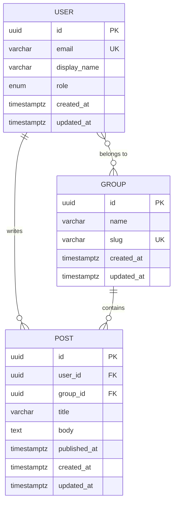

# Data Model Template

> Use this template when running `/design data` to produce entity definitions, ER diagrams, and migration plans.

## Step-by-Step Instructions

1. **Extract entities** from user stories and API requirements.
2. **Define attributes** with types, constraints, and nullability for each entity.
3. **Identify relationships** between entities (1:1, 1:N, M:N).
4. **Draw ER diagram** using Mermaid syntax.
5. **Design indexes** based on query patterns.
6. **Plan Flyway migrations** as sequential numbered scripts.
7. **Map to Java 21 records** for the backend layer.

## Entity Definition Template

For each entity, complete this template:

```yaml
Entity: {{EntityName}}
Table: {{table_name}}
Description: |
  {{What this entity represents in the business domain}}

Attributes:
  - name: id
    type: UUID
    column: id
    constraints: [PRIMARY KEY, NOT NULL, DEFAULT gen_random_uuid()]
    notes: Surrogate primary key

  - name: {{fieldName}}
    type: {{SQL_TYPE}}
    column: {{column_name}}
    constraints: [NOT NULL, UNIQUE, etc.]
    notes: {{Business context or validation rules}}

  - name: createdAt
    type: TIMESTAMP WITH TIME ZONE
    column: created_at
    constraints: [NOT NULL, DEFAULT now()]
    notes: Audit timestamp — set once on creation

  - name: updatedAt
    type: TIMESTAMP WITH TIME ZONE
    column: updated_at
    constraints: [NOT NULL, DEFAULT now()]
    notes: Audit timestamp — updated on every modification

Relationships:
  - target: {{TargetEntity}}
    type: one-to-one | one-to-many | many-to-many
    through: {{join_table_name}}  # only for many-to-many
    joinColumn: {{fk_column_name}}
    inverseJoinColumn: {{inverse_fk_column_name}}  # only for many-to-many
    cascade: [PERSIST, MERGE, DELETE]  # which operations cascade

Indexes:
  - name: idx_{{table}}_{{column}}
    columns: [{{column_name}}]
    unique: true | false
    type: btree | gin | hash
    notes: {{Why this index exists — which query it optimizes}}

Soft Delete: true | false
  # If true, add:
  # - name: deletedAt
  #   type: TIMESTAMP WITH TIME ZONE
  #   column: deleted_at
  #   constraints: [NULL]
  #   notes: Set when soft-deleted; filtered by default in queries
```

## ER Diagram Template

Replace the entities below with your actual data model:



## SQL Type Reference

| Domain Type | SQL Type | Notes |
|---|---|---|
| UUID | `UUID` | Primary keys, foreign keys |
| String (short) | `VARCHAR(n)` | Names, titles, slugs |
| String (long) | `TEXT` | Body content, descriptions |
| Email | `VARCHAR(255)` | Validated at app layer |
| URL | `VARCHAR(2048)` | Max URL length |
| Enum | `VARCHAR(20)` + `CHECK` | Small fixed sets |
| JSON | `JSONB` | Flexible data, preferences |
| Boolean | `BOOLEAN` | Flags, toggles |
| Integer | `INTEGER` | Counts, quantities |
| Long | `BIGINT` | Large counts, IDs from external systems |
| Decimal | `DECIMAL(p, s)` | Money, precise measurements |
| Instant | `TIMESTAMPTZ` | Always store with timezone |
| Date | `DATE` | Calendar dates without time |
| Binary | `BYTEA` | Hashes, encrypted data |

## Flyway Migration Template

```
db/migration/
├── V001__create_{{first_entity}}_table.sql
├── V002__create_{{second_entity}}_table.sql
├── V003__create_{{join_table}}_table.sql
├── V004__{{descriptive_name}}.sql
└── R001__seed_{{reference_data}}.sql
```

### Migration File Template

```sql
-- V{NNN}__{descriptive_name}.sql
-- Description: {{What this migration does}}
-- Author: {{Author or agent}}
-- Date: {{Date}}

-- UP: Apply migration
CREATE TABLE {{table_name}} (
    id              UUID            PRIMARY KEY DEFAULT gen_random_uuid(),
    {{column_name}} {{column_type}} {{constraints}},
    -- ... repeat for each column
    created_at      TIMESTAMPTZ     NOT NULL DEFAULT now(),
    updated_at      TIMESTAMPTZ     NOT NULL DEFAULT now(),

    -- Constraints
    CONSTRAINT uq_{{table}}_{{unique_column}} UNIQUE ({{unique_column}}),
    CONSTRAINT ck_{{table}}_{{check_name}} CHECK ({{check_condition}}),
    CONSTRAINT fk_{{table}}_{{ref_table}} 
        FOREIGN KEY ({{fk_column}}) 
        REFERENCES {{ref_table}}(id)
        ON DELETE CASCADE | SET NULL | RESTRICT
);

-- Indexes
CREATE INDEX idx_{{table}}_{{column}} ON {{table_name}} ({{column}});

-- Updated_at trigger (add to tables that need it)
CREATE TRIGGER trg_{{table}}_updated_at
    BEFORE UPDATE ON {{table_name}}
    FOR EACH ROW
    EXECUTE FUNCTION update_updated_at_column();

-- DOWN: Rollback (documented, not auto-executed)
-- DROP TABLE IF EXISTS {{table_name}};
-- DROP INDEX IF EXISTS idx_{{table}}_{{column}};
```

## Java 21 Record Mapping Template

```java
@Serdeable
public record {{EntityName}}(
    UUID id,
    {{FieldType}} {{fieldName}},
    // ... repeat for each attribute
    Instant createdAt,
    Instant updatedAt
) {
    // Factory method for creation (no id or timestamps)
    public static {{EntityName}} create({{FieldType}} {{fieldName}}, ...) {
        return new {{EntityName}}(
            null, // ID assigned by database
            {{fieldName}},
            // ...
            null, // createdAt assigned by database
            null  // updatedAt assigned by database
        );
    }

    // With method for immutable updates
    public {{EntityName}} with{{FieldName}}({{FieldType}} {{fieldName}}) {
        return new {{EntityName}}(id, {{fieldName}}, /* ... */ createdAt, Instant.now());
    }
}
```

## Data Model Checklist

- [ ] All entities identified from requirements
- [ ] All attributes typed with SQL types and constraints
- [ ] All relationships defined with cardinality
- [ ] ER diagram rendered and verified
- [ ] Indexes designed based on query patterns
- [ ] Flyway migrations planned in sequential order
- [ ] Foreign key order correct (referenced table created first)
- [ ] Java records defined matching database schema
- [ ] Audit columns (createdAt, updatedAt) on all tables
- [ ] Soft delete strategy decided per entity
