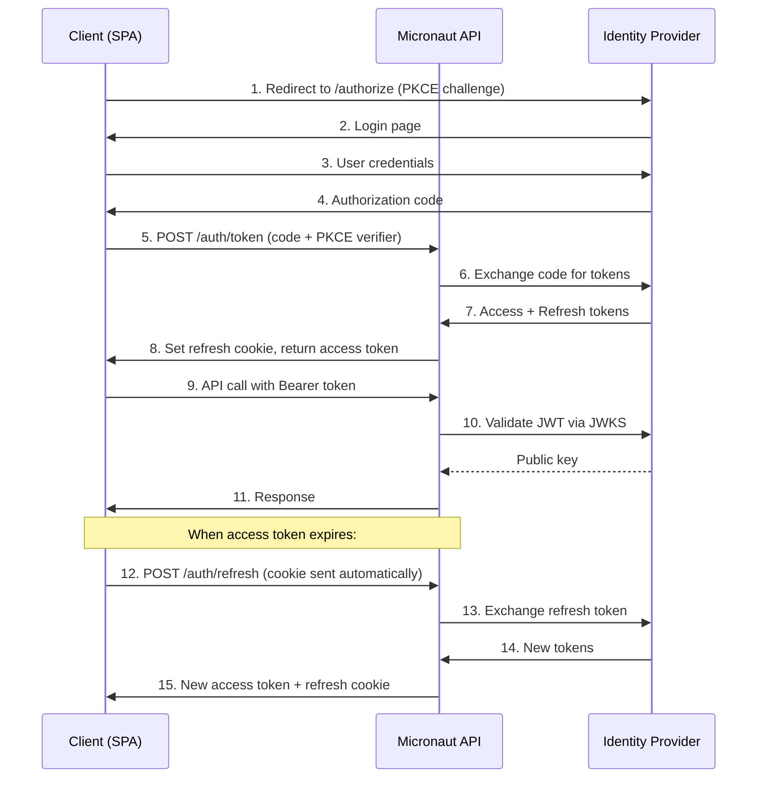

# Security Design Template

> Use this template when running `/design security` to produce a comprehensive security design document.

## Step-by-Step Instructions

1. **Define the authentication flow** — identity provider, token lifecycle, session management.
2. **Design the authorization model** — RBAC roles, ABAC permissions, resource ownership.
3. **Map API endpoints to auth requirements** — which endpoints need which roles/permissions.
4. **Design input validation** — frontend (Zod/Valibot) and backend (Micronaut/Jakarta) schemas.
5. **Define CORS policy** — allowed origins, methods, headers per environment.
6. **Plan security headers** — CSP, HSTS, X-Frame-Options, etc.
7. **Document threat model** — assets, threat actors, attack vectors, mitigations.

## 1. Authentication Flow Template

### Identity Provider Configuration

| Setting | Value |
|---|---|
| Provider | {{Keycloak / Auth0 / Okta / AWS Cognito}} |
| Protocol | OAuth 2.0 + OpenID Connect |
| Grant types | Authorization Code (with PKCE), Refresh Token |
| Token format | JWT (RS256 signed) |
| JWKS endpoint | `{{JWKS_URL}}` |
| Token endpoint | `{{TOKEN_URL}}` |
| Authorize endpoint | `{{AUTHORIZE_URL}}` |

### Token Lifecycle

| Token | Lifetime | Storage | Refresh Strategy |
|---|---|---|---|
| Access token | {{15 minutes}} | Memory (JS variable) | Silent refresh via refresh token |
| Refresh token | {{7 days}} | HttpOnly, Secure, SameSite=Strict cookie | Re-authenticate after expiry |
| ID token | {{15 minutes}} | Not stored (claims extracted once) | N/A |

### Authentication Sequence Diagram



## 2. Authorization Model Template

### RBAC Role Definitions

| Role | ID | Description | Scope | Max Permissions |
|---|---|---|---|---|
| Admin | `admin` | Full system access, user management | Global | All |
| User | `user` | Standard user, owns resources | Organization | Own resources + shared |
| Viewer | `viewer` | Read-only access | Organization | Read only |

### Permission Matrix

| Resource | Action | Admin | User | Viewer |
|---|---|---|---|---|
| Users | List | ✅ | ❌ | ❌ |
| Users | Read | ✅ | Own profile | Own profile |
| Users | Create | ✅ | ❌ | ❌ |
| Users | Update | ✅ | Own profile | ❌ |
| Users | Delete | ✅ | ❌ | ❌ |
| Organizations | List | ✅ | Member orgs | Member orgs |
| Organizations | Read | ✅ | Member orgs | Member orgs |
| Organizations | Create | ✅ | ✅ | ❌ |
| Organizations | Update | ✅ | Owner | ❌ |
| Organizations | Delete | ✅ | ❌ | ❌ |
| Projects | List | ✅ | Member projects | Member projects |
| Projects | Read | ✅ | Member projects | Member projects |
| Projects | Create | ✅ | ✅ | ❌ |
| Projects | Update | ✅ | Owner/Editor | ❌ |
| Projects | Delete | ✅ | Owner | ❌ |
| Documents | List | ✅ | Member docs | Member docs |
| Documents | Read | ✅ | Member docs | Member docs |
| Documents | Create | ✅ | ✅ | ❌ |
| Documents | Update | ✅ | Owner/Editor | ❌ |
| Documents | Delete | ✅ | Owner | ❌ |

### ABAC Rules (Resource Ownership)

```
Access Decision = RBAC_Permission AND Resource_Ownership

Resource_Ownership:
  - Owner: User created the resource → full access
  - Editor: User was granted editor role on parent → read + write
  - Viewer: User was granted viewer role on parent → read only
  - None: User has no relationship → denied (unless admin)
```

## 3. API Endpoint Security Map

| Method | Path | Auth Required | Min Role | Permission | Notes |
|---|---|---|---|---|---|
| `POST` | `/auth/login` | No | — | — | Rate limited: 5 req/min |
| `POST` | `/auth/refresh` | Cookie | — | — | Validates refresh token |
| `POST` | `/auth/logout` | Yes | — | — | Revokes refresh token |
| `GET` | `/users` | Yes | admin | `users:list` | |
| `GET` | `/users/:id` | Yes | user | `users:read` (own) | |
| `POST` | `/users` | Yes | admin | `users:create` | |
| `PUT` | `/users/:id` | Yes | user | `users:update` (own) | |
| `DELETE` | `/users/:id` | Yes | admin | `users:delete` | |
| `GET` | `/organizations` | Yes | user | `orgs:list` (member) | |
| `POST` | `/organizations` | Yes | user | `orgs:create` | |
| `GET` | `/health` | No | — | — | Unauthenticated health check |

## 4. Input Validation Schemas

### Frontend (Zod) Template

```typescript
import { z } from "zod";

// Shared validation helpers
const email = z.string().email("Must be a valid email address").toLowerCase().trim();
const displayName = z.string().min(1, "Required").max(100, "Max 100 characters").trim();
const password = z.string().min(8, "Min 8 characters").regex(
  /^(?=.*[a-z])(?=.*[A-Z])(?=.*\d)/,
  "Must contain uppercase, lowercase, and number"
);

// Schemas
export const loginSchema = z.object({
  email,
  password: z.string().min(1, "Required"),
});

export const createUserSchema = z.object({
  email,
  displayName,
  role: z.enum(["admin", "user", "viewer"]),
});

export const updateUserSchema = z.object({
  displayName: displayName.optional(),
  role: z.enum(["admin", "user", "viewer"]).optional(),
});

export const changePasswordSchema = z.object({
  currentPassword: z.string().min(1, "Required"),
  newPassword: password,
  confirmPassword: z.string(),
}).refine((d) => d.newPassword === d.confirmPassword, {
  message: "Passwords do not match",
  path: ["confirmPassword"],
});

// Export types
export type LoginInput = z.infer<typeof loginSchema>;
export type CreateUserInput = z.infer<typeof createUserSchema>;
export type UpdateUserInput = z.infer<typeof updateUserSchema>;
export type ChangePasswordInput = z.infer<typeof changePasswordSchema>;
```

### Backend (Micronaut) Template

```java
@Serdeable
public record CreateUserRequest(
    @NotBlank(message = "Email is required")
    @Email(message = "Must be a valid email address")
    String email,

    @NotBlank(message = "Display name is required")
    @Size(min = 1, max = 100, message = "Must be 1-100 characters")
    String displayName,

    @NotBlank(message = "Role is required")
    @Pattern(regexp = "admin|user|viewer", message = "Invalid role")
    String role
) {}
```

## 5. CORS Policy Template

| Environment | Allowed Origins | Allow Credentials | Max Age |
|---|---|---|---|
| Development | `http://localhost:3000`, `http://localhost:3001` | Yes | 3600s |
| Staging | `https://staging.example.com` | Yes | 3600s |
| Production | `https://app.example.com`, `https://admin.example.com` | Yes | 3600s |

**Allowed Methods:** `GET`, `POST`, `PUT`, `PATCH`, `DELETE`, `OPTIONS`

**Allowed Headers:** `Authorization`, `Content-Type`, `X-Request-ID`

**Exposed Headers:** `X-Request-ID`, `X-RateLimit-Remaining`, `X-RateLimit-Reset`

## 6. Security Headers

| Header | Value | Purpose |
|---|---|---|
| `Strict-Transport-Security` | `max-age=31536000; includeSubDomains; preload` | Force HTTPS |
| `Content-Security-Policy` | `default-src 'self'; script-src 'self'; style-src 'self' 'unsafe-inline'; img-src 'self' data: https:; font-src 'self' https://fonts.gstatic.com; connect-src 'self' {{API_URL}}` | XSS prevention |
| `X-Content-Type-Options` | `nosniff` | Prevent MIME sniffing |
| `X-Frame-Options` | `DENY` | Prevent clickjacking |
| `Referrer-Policy` | `strict-origin-when-cross-origin` | Limit referrer leakage |
| `Permissions-Policy` | `camera=(), microphone=(), geolocation=()` | Restrict browser APIs |

## 7. Threat Model Template

### Assets

| Asset | Classification | Storage | Access |
|---|---|---|---|
| User passwords | Secret | Hashed (bcrypt/argon2) in IDP | Never exposed |
| JWT access tokens | Secret | In-memory (client) | Sent via Authorization header |
| JWT refresh tokens | Secret | HttpOnly cookie | Sent automatically via HTTPS |
| User PII (email, name) | Confidential | Database (encrypted at rest) | Via API with auth |
| API keys | Secret | Hashed in database | Via API with admin auth |
| Application data | Confidential | Database (encrypted at rest) | Via API with auth |

### Threat Actors

| Actor | Motivation | Attack Vectors | Mitigations |
|---|---|---|---|
| Anonymous attacker | Data theft, disruption | Brute force, DDoS, injection | Rate limiting, input validation, WAF |
| Authenticated user | Privilege escalation, data access | IDOR, parameter tampering | Authorization checks, resource ownership |
| Compromised account | Data exfiltration | Session hijack, token theft | Short token lifetime, refresh rotation |
| Malicious insider | Data theft | Excessive permissions | Principle of least privilege, audit logging |

### Attack Vector Mitigations

| Attack | Mitigation | Implementation |
|---|---|---|
| SQL Injection | Parameterized queries | Micronaut Data prepared statements |
| XSS | Input sanitization + CSP | Content-Security-Policy header, DOM textContent |
| CSRF | SameSite cookies + token validation | SameSite=Strict on auth cookies |
| Brute Force | Rate limiting | 5 req/min on login, exponential backoff |
| Token Theft | Short lifetime + rotation | 15-min access, refresh rotation |
| IDOR | Resource ownership checks | Every query filtered by authenticated user |
| Mass Assignment | Explicit field allowlisting | Java records (no setter), explicit DTOs |
| Sensitive Data Exposure | Encryption + access control | TLS in transit, encryption at rest, PII masking in logs |

## Security Design Checklist

- [ ] Authentication flow fully documented with sequence diagram
- [ ] All roles and permissions defined in matrix
- [ ] Every API endpoint mapped to minimum role and permission
- [ ] Frontend validation schemas defined for all forms
- [ ] Backend validation annotations applied to all request DTOs
- [ ] CORS policy defined per environment (never `*` in production)
- [ ] Security headers configured for all responses
- [ ] Threat model completed with assets, actors, and mitigations
- [ ] Rate limiting configured on authentication endpoints
- [ ] Audit logging designed for all write operations
- [ ] Secrets management strategy documented (env vars / vault)
- [ ] HTTPS enforced on all environments
